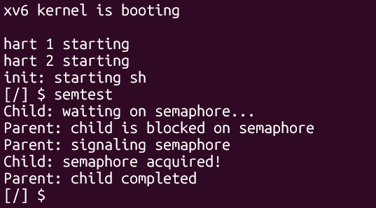

# Semaphore Implementation in xv6 - Documentation

## Overview

Here we describe the implementation of user-level semaphores in xv6. xv6 does not use semaphores, hence we make this change to enable inter-process synchronization and mutual exclusion through three new system calls. This was implemented by 24JE0683

---

## System Calls

### `sem_init(int id, int value)`
Use: Initializes semaphore with given value.
- **Parameters:** id (0-9), value (≥ 0)
- **Returns:** 0 on success, -1 on error

### `sem_down(int id)`
Use: Wait operation (P). Decrements if value > 0, otherwise waits.
- **Parameters:** id (0-9)
- **Returns:** 0 on success, -1 on error

### `sem_up(int id)`
Use: Signal operation (V). Increments semaphore value.
- **Parameters:** id (0-9)
- **Returns:** 0 on success, -1 on error

---

## Modified Files

| File | Changes |
|------|---------|
| `kernel/syscall.h` | Added SYS_sem_init (23), SYS_sem_down (24), SYS_sem_up (25) |
| `kernel/proc.h` | Added semaphore structure and NSEM=10 |
| `kernel/sysproc.c` | Implemented three system calls + sem_init_all() |
| `kernel/syscall.c` | Registered syscalls in array |
| `kernel/main.c` | Call sem_init_all() during boot |
| `kernel/defs.h` | Added extern declaration |
| `user/user.h` | Added function prototypes |
| `user/usys.pl` | Added syscall stubs |
| `user/semtest.c` | Test program |
| `Makefile` | Added _semtest to UPROGS |

---

## Implementation

### Semaphore Structure
```c
struct semaphore {
  struct spinlock lock;
  int value;
};

#define NSEM 10  // 10 total semaphores
```

### Key Features
- **Spinlock protection:** All operations are atomic
- **Busy-wait with yield:** Waiting processes yield CPU to others
- **Global kernel array:** Shared by all processes
- **Simple validation:** ID and value checking on all calls

### System Call Flow
1. Extract arguments from registers using `argint()`
2. Validate ID (0-9) and value range
3. Acquire spinlock protecting semaphore
4. Perform operation (init/down/up)
5. Release spinlock
6. Return 0 on success, -1 on error

---

## Usage Example

### Basic Synchronization
```c
#include "user/user.h"

int main(void)
{
  sem_init(0, 0);  // Initialize locked
  
  int pid = fork();
  if(pid == 0) {
    printf("Child waiting...\n");
    sem_down(0);   // Blocks here
    printf("Child proceeding\n");
    exit(0);
  } else {
    printf("Parent signaling...\n");
    sem_up(0);     // Unblock child
    wait(0);
  }
  exit(0);
}
```

### Mutual Exclusion
```c
sem_init(0, 1);  // Binary semaphore

sem_down(0);
// critical section
sem_up(0);
```

### Resource Pool
```c
sem_init(0, 5);  // 5 resources

sem_down(0);     // Acquire
// use resource
sem_up(0);       // Release
```

---

## Building and Testing

### Build
```bash
make clean
make qemu
```

### Run Test
```bash
$ semtest
```

### Output
```
```


---

## Design Decisions

| Decision | Rationale |
|----------|-----------|
| Fixed array (NSEM=10) | Simple allocation, sufficient for demos |
| Busy-wait + yield | Simpler than wait queues, fair scheduling |
| Global scope | Easy inter-process access |
| Spinlock protection | Atomic operations, no race conditions |
| No initialization flag | Assume user initializes before use |

---

## Limitations

- Only 10 semaphores available (fixed NSEM)
- No semaphore destruction
- No timeout support
- No priority inheritance
- Busy-wait has slightly higher CPU usage than true blocking

---

## Synchronization Guarantees

✓ **Atomicity:** All value modifications protected by spinlock  
✓ **Mutual Exclusion:** Only one process modifies value at a time  
✓ **Fairness:** Yielding prevents starvation of waiting processes  
✓ **Correctness:** sem_down waits until sem_up is called  

---

## Testing

The `semtest` program verifies:
- Semaphore initialization works
- Child can block on sem_down()
- Parent can signal with sem_up()
- Proper execution order is maintained (synchronization works)

Output demonstrates processes cannot race ahead of synchronization point.

