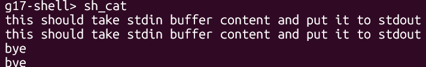
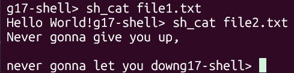
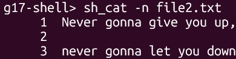
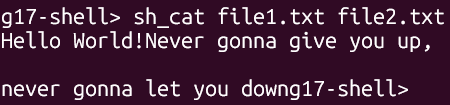
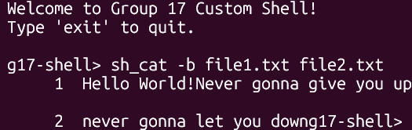
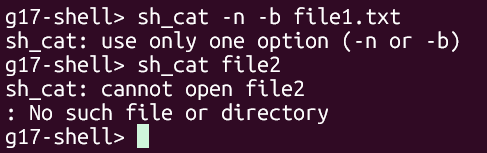

# sh_cat - File Display Utility Documentation

## Overview
`sh_cat` is a custom implementation of the Unix `cat` command. It reads and displays file contents to stdout, with optional line numbering. This implementation was done by 24JE0683.

## Usage
```
sh_cat [OPTION] [FILE(s)]
```

## Options
- `-n`: Number all lines
- `-b`: Number only non-empty lines

## Behavior
- If no file is specified, reads from stdin
- If multiple files are provided, concatenates them
- Only one option (`-n` or `-b`) can be used at a time
- Exits with status 1 on file open or read errors, continues with other files
- Outputs to stdout (fd 1)

## Examples 
```






```
